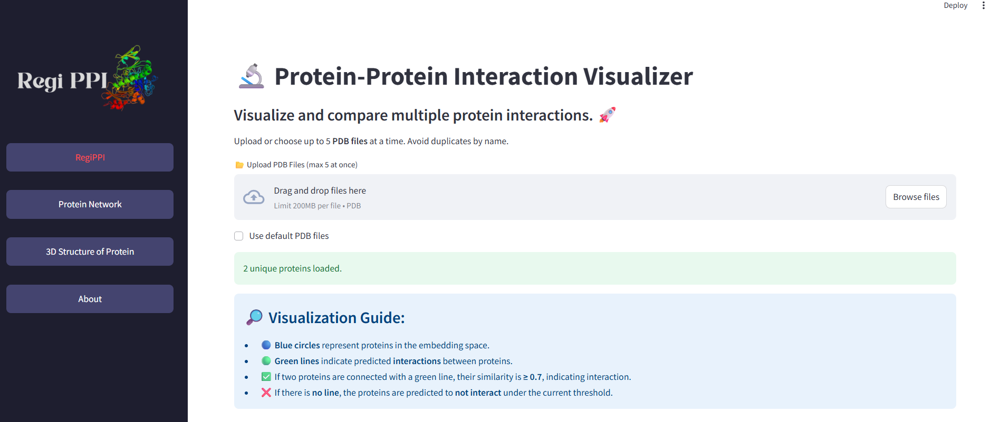
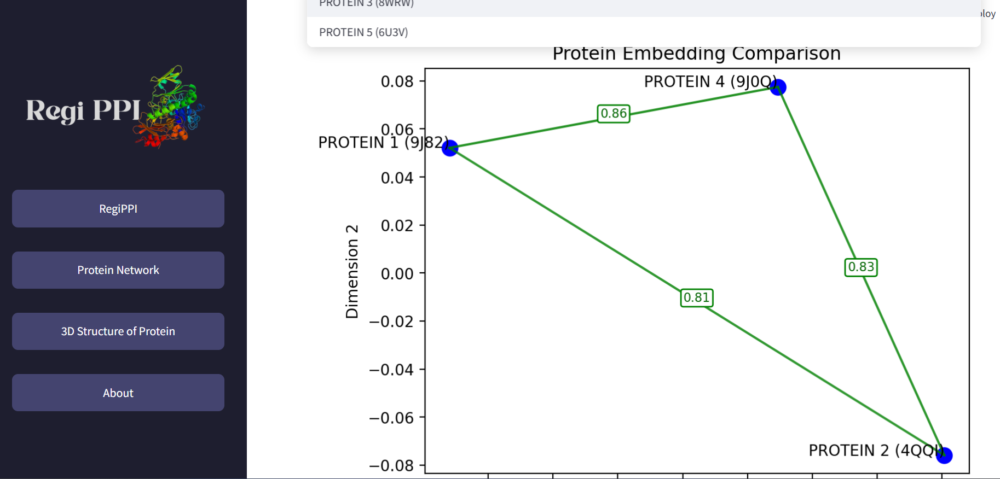
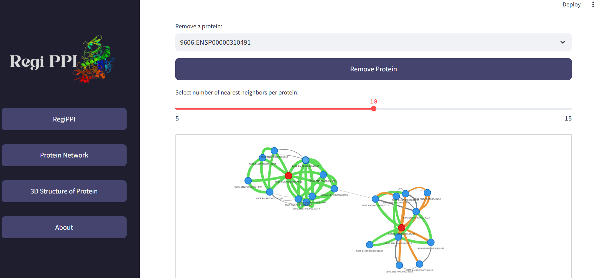
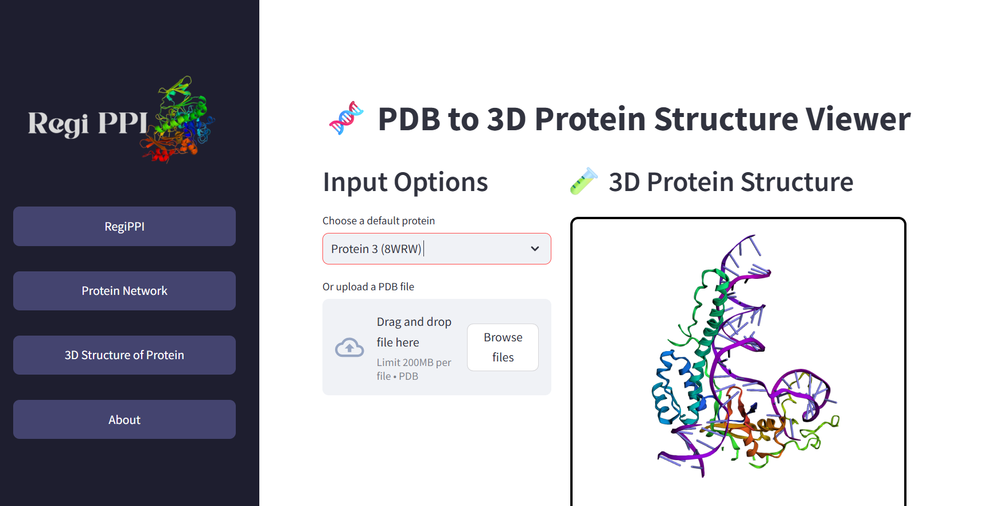

# 🔬 Protein–Protein Interaction (PPI) Visualizer

🧪 **Test Live:**  
👉 **Live Application:** https://regippi-bylvxuy9q8edt8s5vcyejt.streamlit.app/  
👉 **Demo Dataset:** Preloaded (no setup required)

An interactive web application to **analyze, visualize, and explore protein–protein interactions** using embedding-based similarity, large-scale interaction networks, and 3D protein structures.

Built with **Streamlit**, **NetworkX**, **PyVis**, and **PyMOL-based 3D visualization**.

---

## 🚀 Application Overview

The application consists of **three main visualization sections**, accessible from the sidebar:

1. **Protein–Protein Interaction Visualizer (Embedding-based)**
2. **Protein Interaction Network Graph Visualizer**
3. **PDB to 3D Protein Structure Viewer**

Each section focuses on a different biological perspective:
> **Similarity → Network → Structure**

---

# 1️⃣ 🔬 Protein–Protein Interaction Visualizer

Visualize and compare **multiple protein interactions** based on embedding similarity.

---

### 🖼️ Interface Preview

*(Replace this image with a screenshot of the embedding-based interaction view)*

---

### ✨ Features
- Upload or select **up to 5 PDB files** simultaneously
- Prevents duplicate proteins by name
- Embedding-based interaction prediction
- Intuitive visual interpretation of similarity

---

### 📂 Input Options
- Upload PDB files (max **5 at once**)
- Select from predefined default proteins

**File constraints**
- Max size: **200 MB per file**
- Format: `.pdb`

---

### 🔎 Visualization Guide

- 🔵 **Blue circles** represent proteins in the embedding space  
- 🟢 **Green lines** indicate predicted interactions  
- ✅ A green connection means **similarity ≥ 0.7**, suggesting interaction  
- ❌ No connection means the proteins are **not predicted to interact** under the current threshold  

This view enables rapid comparison of protein similarity and interaction likelihood.

---

# 2️⃣ 🧬 Protein Interaction Network Graph Visualizer

Explore large-scale protein–protein interaction (PPI) data as an **interactive, force-directed network graph**.

---

### 🖼️ Interface Preview

*(Replace this image with a screenshot of the interactive graph with spring-like edges)*

---

### 📊 Dataset Scale
- ✅ **843,262 protein–protein interactions**
- ✅ **19,699 protein embeddings**

---

### 🧠 Graph Representation
- **Nodes:** Proteins  
- **Edges:** Interactions  
- **Edge color:** Confidence level  
- **Edge thickness:** Interaction strength  

The graph uses a **physics-based layout**, resulting in a dynamic, “bouncy” visualization where proteins cluster based on interaction strength.

---

### 🎛️ Interactive Controls
- **Currently exploring:** shows selected protein(s)
- **Add a protein to explore:** dynamically expands the network
- **Nearest neighbors slider:**
  - Range: **5–15**
  - Controls graph density and visual clarity

---

### 📌 Embedding Inspection

For selected proteins, the application displays the **first 5 embedding dimensions**:

This helps users understand:
- How proteins are represented numerically
- Why specific interactions are predicted
- Differences between closely related proteins

---

# 3️⃣ 🧪 PDB to 3D Protein Structure Viewer

Visualize protein **three-dimensional structures** directly from PDB files.

---

### 🖼️ Interface Preview

*(Replace this image with a screenshot of the 3D protein structure view)*

---

### 🔧 Input Options
- Choose a **default protein**
  - Example: *Protein 1 (9J82)*
- Or upload a custom PDB file

**File constraints**
- Max size: **200 MB**
- Format: `.pdb`

---

### 🧬 3D Structure Visualization
- Interactive 3D rendering
- Rotation and inspection of protein geometry
- Generated using **PyMOL-based rendering**

This section bridges the gap between:
> **Protein identity → Structural form → Functional interaction**

---

## 🛠️ Technology Stack

- **Frontend:** Streamlit  
- **Graph Analysis:** NetworkX  
- **Graph Visualization:** PyVis  
- **Protein Embeddings:** Precomputed protein language model embeddings  
- **3D Structure Rendering:** PyMOL  
- **Data Hosting:** Hugging Face Datasets, Google Drive  

---

## 🎯 Use Cases

- Protein–protein interaction analysis  
- Bioinformatics education and teaching  
- Large-scale PPI dataset exploration  
- Linking embeddings, networks, and structure  
- Research prototyping and visualization  

---

## ⚠️ Performance Notes

- Large interaction graphs may take time to render.
- Start with **fewer nearest neighbors** for smoother interaction.
- Gradually expand the network for detailed exploration.
- Site might be slow for streamlit free hosting

